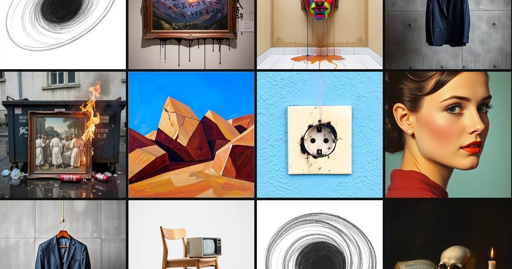

# The Unending

## Licensing

This repository is licensed in two halves, because it contains two different kinds of content.

| | Covers | Terms |
|---|---|---|
| [`LICENSE`](LICENSE) | Jekyll includes and layouts, JS, CSS, Lambda handlers, tools under `code/` | MIT |
| [`CONTENT-TERMS.md`](CONTENT-TERMS.md) | Generated images, prompt texts, page copy, poster and OG compositions | CC BY-NC 4.0 |

The code here is open, do what you like with it. Image sets are shared for your viewing pleasure (or displeasure) and building on non-commercially. If you want to sell something made from these images, contact me for originals worth doing that or follow the patterns here yourself, which are open and repeatable. 

`LICENSE-CONTENT` under current U.S. law the raw model outputs likely have no copyright holder at all, so restricting on them is "polite;" closer to a request than a rule. "All rights reserved" for AI generated work may reserve nothing.

**This project's name is separate.** "The Unending" and the "Un" mark aren't granted by either license.

## Current Tooling

Generated with the following models: 
- **FLUX.1 [schnell] 12B** (Black Forest Labs) — Apache-2.0, commercial use permitted.
- **FLUX.2 [klein] 4B** (Black Forest Labs) — Apache-2.0, commercial use permitted. (The 9B variant is non-commercial; this project uses 4B.)
- **Perception Encoder / PE Core** (Meta) — Apache-2.0. Embeddings behind the similar-image tiles.

Compute on an L40S in AWS, A10 at Lambda labs, or an A100 at Lambda Labs.
